# Guía visual: instalar y probar QuoteOps desde cero en un VPS

Esta guía reproduce una instalación real de laboratorio como si la realizara una persona que nunca ha instalado QuoteOps. La corrida final quedó en `v0.1.7`, para el cliente ficticio `RESAUX`, con:

- usuario autorizado `alejandro@resaux.io`;
- entrada de solicitudes por Resend;
- extracción por NVIDIA NIM;
- cálculo de ruta y peajes por INEGI SAKBÉ;
- un TMS HTTP local que simula el contrato de un sistema tipo SAP; y
- aprobación humana, writeback y respuesta por correo con PDF.

> Importante: el TMS de esta prueba simula una integración estilo SAP. No es un conector SAP certificado ni se conectó a un tenant SAP real.

> Seguridad: ninguna instrucción muestra llaves, tokens, licencias completas ni enlaces mágicos. Cuando vea `[SECRETO]`, pegue el valor desde el gestor seguro. No lo escriba en Git, en una captura ni directamente en un comando que quede guardado en el historial.

## Antes de empezar

Necesita:

- acceso al portal de QuoteOps;
- acceso SSH como operador del VPS;
- Docker y Docker Compose instalados;
- un paquete nuevo de instalación del cliente;
- una llave operativa de Resend, NVIDIA NIM e INEGI SAKBÉ; y
- una dirección de recepción que haya superado una entrega real.

En cada paso compruebe el **resultado esperado** antes de continuar. Si no coincide, deténgase: avanzar suele convertir un problema pequeño en una instalación difícil de diagnosticar.

## 1. Confirmar el cliente en la nube

**Objetivo:** verificar que el correo autorizado abre el tenant correcto antes de tocar el VPS.

1. Abra el portal de QuoteOps.
2. Solicite el enlace mágico con el correo autorizado.
3. Entre a **Perfil de cliente**.
4. Confirme el cliente, el ID de instalación y la versión anterior.

En esta corrida, `alejandro@resaux.io` ya pertenecía a `RESAUX`; se conservó su ID canónico `resaux-prod-001` y se reemplazó únicamente la instalación local.

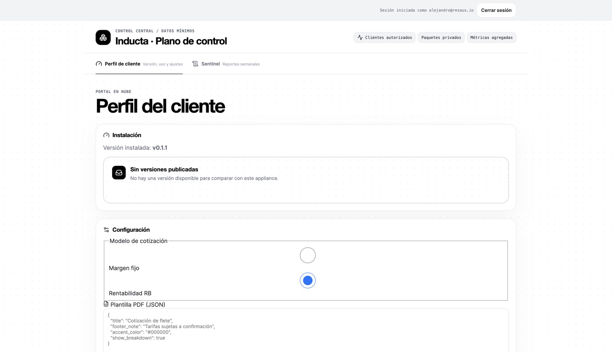

**Resultado esperado:** el portal muestra `Resaux Operaciones (RESAUX)` y una instalación identificable.

**Si falla:** no cree otro tenant con un nombre parecido. Confirme el correo y pida acceso al tenant correcto.

## 2. Comprobar que Resend puede recibir de verdad

**Objetivo:** evitar que el primer RFQ rebote aunque el panel muestre el dominio como verificado.

1. En Resend, abra **Domains**.
2. Confirme que el dominio de salida aparezca como `Verified`.
3. Compruebe también el MX público del dominio de entrada.
4. Envíe un correo de prueba y confirme que aparece en Resend Receiving.

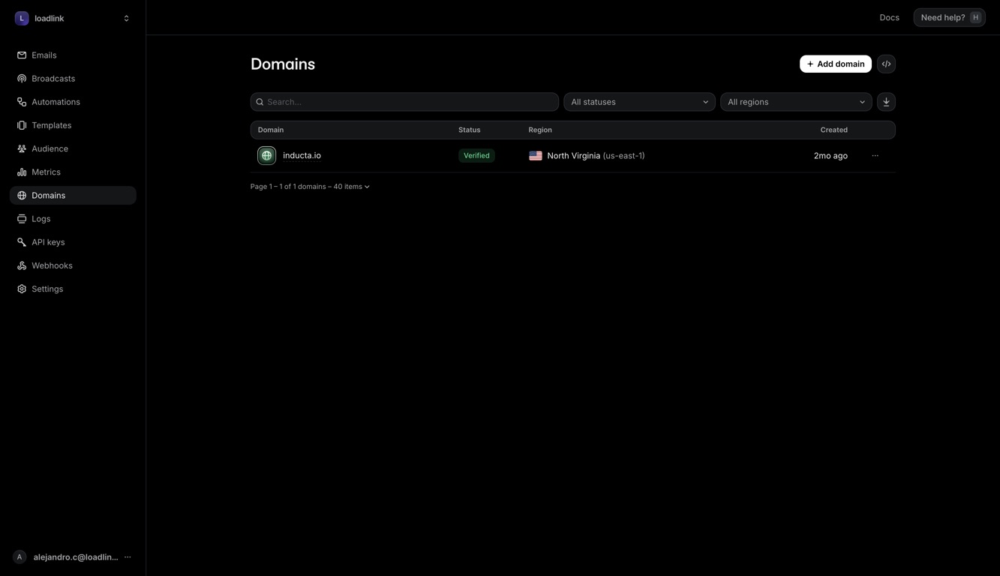

En esta prueba, `inducta.io` aparecía verificado, pero su MX público apuntaba a Google Workspace. El primer mensaje a `cotizaciones@inducta.io` rebotó porque esa cuenta no existía en Google. La corrida final utilizó una bandeja sintética del dominio administrado `*.resend.app`, sin cambiar el correo corporativo.

**Resultado esperado:** una entrega real aparece en Resend, no sólo una insignia `Verified`.

**Si falla:** use un subdominio aislado para recepción o el dominio administrado por Resend. No cambie el MX raíz de una empresa sin autorización.

## 3. Probar las APIs antes de copiarlas al VPS

**Objetivo:** distinguir una llave inválida de un problema del instalador.

Desde un entorno seguro, valide por separado:

- Resend: la API responde HTTP 200 y puede ver el correo de prueba.
- NVIDIA NIM: `nvidia/nemotron-3-ultra-550b-a55b` completa una solicitud mínima con HTTP 200.
- SAKBÉ: una ruta en modo en vivo devuelve distancia y peajes.

La validación de esta corrida obtuvo 98.89 km para Monterrey–Saltillo, con 879 MXN en peajes.

**Resultado esperado:** las tres pruebas son correctas antes de almacenar valores en el VPS.

**Si falla:** no copie esa llave. Una llave de NVIDIA que puede listar modelos, pero no completar una solicitud, no es suficiente.

## 4. Autorizar al administrador y generar un paquete nuevo

**Objetivo:** obtener un paquete con un token de registro de un solo uso.

1. En la pantalla de acceso administrativo, escriba su correo autorizado y pulse **Enviar enlace mágico**.

   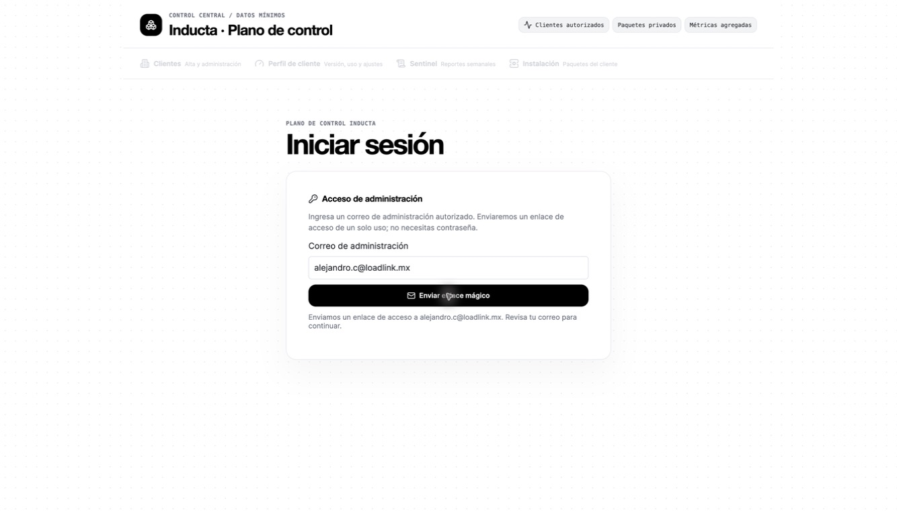

2. Abra el correo y pulse **Sign in**. El enlace caduca y sólo puede usarse una vez; no lo copie a esta guía.

   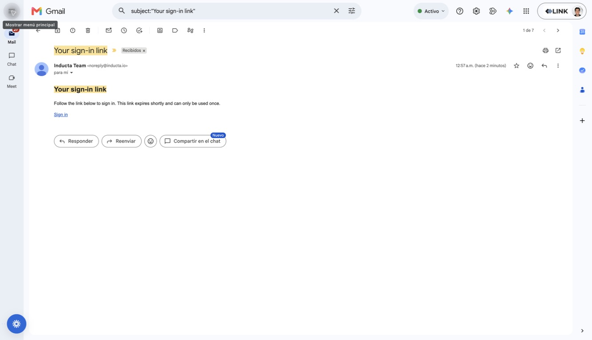

3. En **Clientes**, localice `RESAUX` y pulse **Generar paquete de instalación**.
4. Descargue y extraiga el paquete en `/root/quoteops-install-resaux`.

   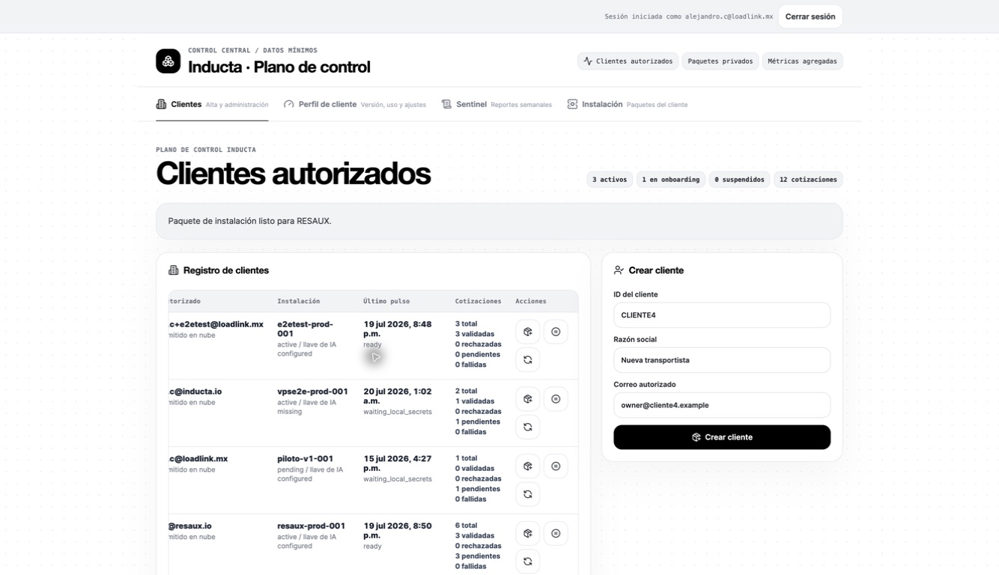

**Resultado esperado:** el portal confirma “Paquete de instalación listo para RESAUX”. El ID sigue siendo `resaux-prod-001`; sólo cambia el token temporal.

**Si falla:** genere otro paquete. Nunca reutilice un token ya consumido.

## 5. Inventariar el VPS antes de borrar nada

**Objetivo:** eliminar exclusivamente la instalación QuoteOps incluida en la prueba.

Ejecute:

```bash
docker compose ls --format table
```

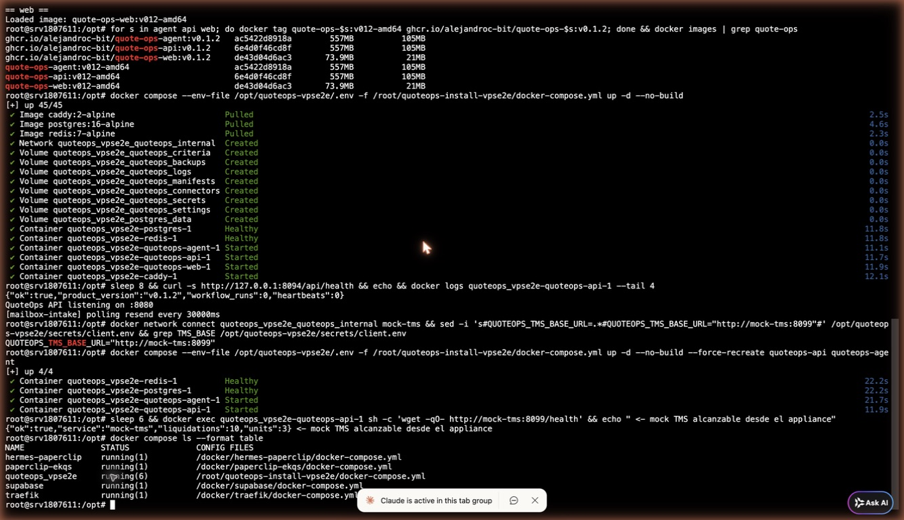

En el VPS de esta corrida se conservaron `hermes-paperclip`, `paperclip-ekqs`, `supabase` y `traefik`. El único objetivo anterior era `quoteops_vpse2e`.

Para detener y eliminar los volúmenes de ese proyecto exacto:

```bash
docker compose \
  -p quoteops_vpse2e \
  -f /root/quoteops-install-vpse2e/docker-compose.yml \
  down --volumes --remove-orphans
```

**Resultado esperado:** `docker compose ls` ya no incluye `quoteops_vpse2e`; los cuatro proyectos compartidos siguen `running`.

**Si falla:** no use `docker system prune`, no borre `/opt` completo y no use un nombre de proyecto aproximado.

## 6. Preparar la versión exacta `v0.1.7`

**Objetivo:** instalar una versión inmutable y revisable, nunca `latest`.

```bash
git clone --branch v0.1.7 --depth 1 \
  https://github.com/alejandroc-bit/quote_ops_v1.git \
  /root/quoteops-source-v017

git -C /root/quoteops-source-v017 describe --tags --exact-match
```

La última línea debe imprimir exactamente:

```text
v0.1.7
```

Defina las rutas no sensibles:

```bash
export QUOTEOPS_REPO=/root/quoteops-source-v017
export FIXTURE_DIR="$QUOTEOPS_REPO/deploy/appliance/examples/human-simulator"
export PACK_DIR=/root/quoteops-install-resaux
export QUOTEOPS_HOME=/opt/quoteops-resaux
export COMPOSE_PROJECT_NAME=quoteops_resaux
export QUOTEOPS_VERSION=v0.1.7
export CONTROL_PLANE_URL=https://quote-ops-portal.vercel.app
```

Lea el token sin mostrarlo:

```bash
read -r -s -p 'Token nuevo de RESAUX: ' REGISTRATION_TOKEN; echo
```

Prepare los archivos sin iniciar contenedores todavía:

```bash
COMPOSE_PROJECT_NAME="$COMPOSE_PROJECT_NAME" \
bash "$PACK_DIR/install.sh" \
  --client RESAUX \
  --manifest "$FIXTURE_DIR/client-manifest.yaml" \
  --connectors "$FIXTURE_DIR/connectors" \
  --agent-config "$FIXTURE_DIR/connectors/agent/agent-config.yaml" \
  --tms-adapter-config "$FIXTURE_DIR/connectors/tms-adapter.yaml" \
  --tms-mapping-config "$FIXTURE_DIR/connectors/tms-mapping.json" \
  --home "$QUOTEOPS_HOME" \
  --control-plane-url "$CONTROL_PLANE_URL" \
  --registration-token "$REGISTRATION_TOKEN" \
  --installation-id resaux-prod-001 \
  --version "$QUOTEOPS_VERSION" \
  --http-port 8094 \
  --https-port 8497 \
  --sakbe-cache-mode live_only \
  --skip-start --no-pull

unset REGISTRATION_TOKEN
```

**Resultado esperado:** existen `/opt/quoteops-resaux/.env` y `/opt/quoteops-resaux/secrets/client.env`, ambos con permisos `600`.

**Nota de esta corrida:** GHCR respondió `403` al VPS por falta de acceso al registro privado. Las imágenes de `v0.1.7` se construyeron localmente desde el tag exacto y Compose se levantó con `--pull never`. Es un problema de autenticación del registro, no un fallo del runtime de QuoteOps. En una instalación normal, configure `docker login ghcr.io` con una credencial de sólo lectura.

## 7. Cargar secretos sin imprimirlos

**Objetivo:** guardar cada valor en el archivo root-only del appliance.

```bash
SECRET_TOOL="$QUOTEOPS_REPO/deploy/appliance/secrets.sh"

read -r -s -p 'NVIDIA NIM API key: ' VALUE; echo
printf '%s\n' "$VALUE" | bash "$SECRET_TOOL" --home "$QUOTEOPS_HOME" set NVIDIA_NIM_API_KEY --stdin
unset VALUE

read -r -s -p 'Resend API key: ' VALUE; echo
printf '%s\n' "$VALUE" | bash "$SECRET_TOOL" --home "$QUOTEOPS_HOME" set RESEND_API_KEY --stdin
unset VALUE

read -r -s -p 'INEGI SAKBÉ key: ' VALUE; echo
printf '%s\n' "$VALUE" | bash "$SECRET_TOOL" --home "$QUOTEOPS_HOME" set INEGI_SAKBE_KEY --stdin
unset VALUE

read -r -p 'Bandeja real de Resend: ' VALUE
printf '%s\n' "$VALUE" | bash "$SECRET_TOOL" --home "$QUOTEOPS_HOME" set MAILBOX_USER --stdin
unset VALUE

read -r -p 'Remitente verificado: ' VALUE
printf '%s\n' "$VALUE" | bash "$SECRET_TOOL" --home "$QUOTEOPS_HOME" set MAILBOX_FROM --stdin
unset VALUE

printf '%s\n' 'http://mock-tms:8099' | \
  bash "$SECRET_TOOL" --home "$QUOTEOPS_HOME" set MOCK_TMS_BASE_URL --stdin

bash "$SECRET_TOOL" --home "$QUOTEOPS_HOME" list
stat -c '%a %U:%G %n' "$QUOTEOPS_HOME/.env" "$QUOTEOPS_HOME/secrets/client.env"
```

**Resultado esperado:** el listado enseña únicamente nombres con estado `set`; `stat` devuelve `600 root:root` para los dos archivos.

**Si falla:** no ejecute `cat` sobre el archivo de secretos ni lo copie a una captura.

## 8. Iniciar el TMS ficticio y QuoteOps

**Objetivo:** crear una red privada y arrancar los seis servicios del appliance.

```bash
export COMPOSE_FILE=/root/quoteops-install-resaux/docker-compose.yml
export NETWORK=quoteops_resaux_quoteops_internal
export MOCK_CONTAINER=quoteops-resaux-mock-tms

docker compose --env-file "$QUOTEOPS_HOME/.env" -f "$COMPOSE_FILE" \
  up -d --force-recreate postgres redis

docker network inspect "$NETWORK" >/dev/null

docker rm -f "$MOCK_CONTAINER" 2>/dev/null || true
docker run -d --name "$MOCK_CONTAINER" \
  --network "$NETWORK" --network-alias mock-tms \
  -v "$QUOTEOPS_REPO/deploy/appliance/mock-tms/server.mjs:/app/server.mjs:ro" \
  node:22-alpine node /app/server.mjs

docker compose --env-file "$QUOTEOPS_HOME/.env" -f "$COMPOSE_FILE" \
  up -d --force-recreate --pull never

docker compose --env-file "$QUOTEOPS_HOME/.env" -f "$COMPOSE_FILE" ps
```

**Resultado esperado:** Postgres y Redis están `healthy`; agent, API, web y Caddy están `running`. El mock no publica ningún puerto al exterior.

## 9. Activar y cerrar el onboarding

1. Abra `http://IP_DEL_VPS:8094`.
2. Use el flujo de activación con `alejandro@resaux.io`.
3. Abra **Estado**.

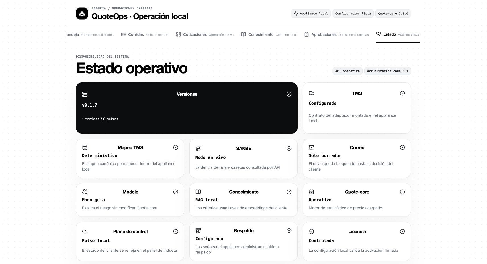

**Resultado esperado:** la pantalla muestra `v0.1.7`, `API operativa`, `TMS Configurado`, `SAKBE Modo en vivo`, `Configuración lista` y licencia controlada.

Compruébelo también desde una máquina con `curl` y Node:

```bash
bash "$FIXTURE_DIR/verify.sh" http://IP_DEL_VPS:8094
```

Debe devolver `health.ok: true`, `product_version: v0.1.7`, activación `unlocked` y `required_steps: []`.

## 10. Enviar el RFQ como un cliente nuevo

**Objetivo:** comprobar el recorrido real desde el correo, no insertar una fila manualmente.

1. Entre a Gmail como `alejandro@resaux.io`.
2. Envíe a la bandeja sintética de Resend configurada como `MAILBOX_USER`.
3. Use un asunto único, por ejemplo `RFQ simulada FINAL v0.1.7 — GDL a Monterrey`.
4. Indique Guadalajara → Monterrey, caja seca de 53 pies, 18,000 kg y carga general.
5. Aclare que es una prueba sintética.

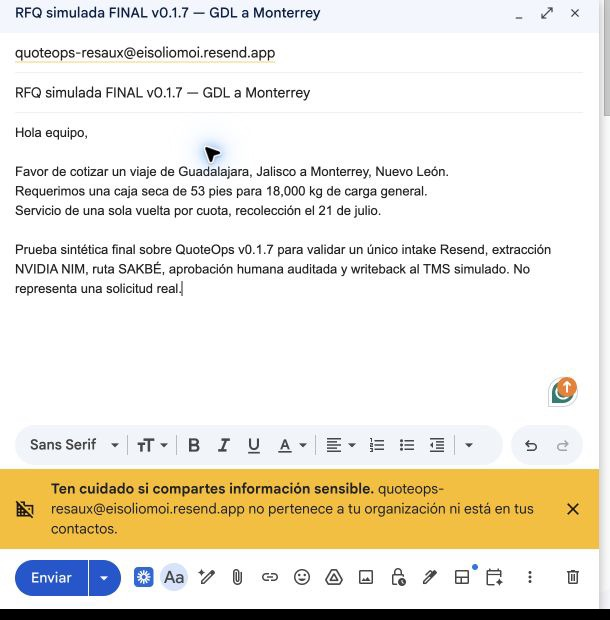

**Resultado esperado:** Resend recibe exactamente un mensaje y QuoteOps crea exactamente una corrida nueva.

## 11. Revisar y aprobar la corrida

La corrida final fue `run-rfq-2026-771655`.

Antes de aprobar, la interfaz mostró **Espera aprobación**:

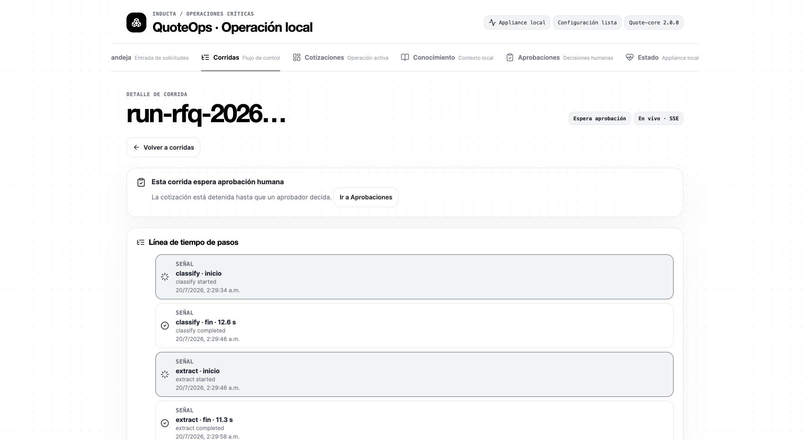

Después de la decisión auditada, mostró **Completada**:

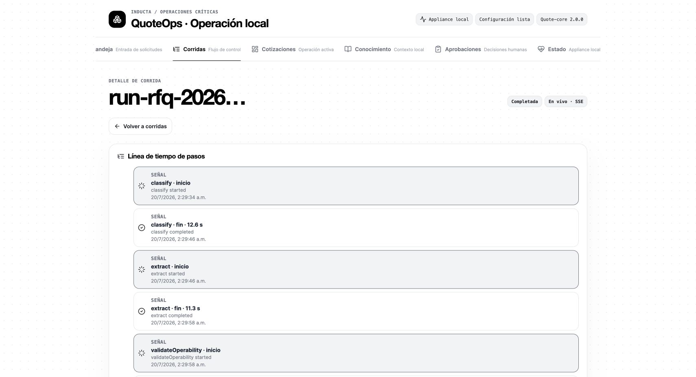

La prueba verificó:

- 25 eventos de pasos desde `classify` hasta `writeback`;
- extracción estructurada con NVIDIA NIM;
- ruta con evidencia SAKBÉ;
- precio final de 34,842.26 MXN;
- decisión `approve` guardada antes de reanudar;
- un quote writeback al TMS ficticio; y
- un status writeback adicional mediante el adaptador real.

> El writeback de cotización pertenece al RFQ real. El writeback de estado fue una prueba separada del contrato del adaptador; no debe interpretarse como un segundo comportamiento automático del mismo workflow.

## 12. Confirmar correo, PDF y estado final en la nube

Gmail recibió una respuesta desde `cotizaciones@inducta.io` con el PDF `run-rfq-2026-771655.pdf`.

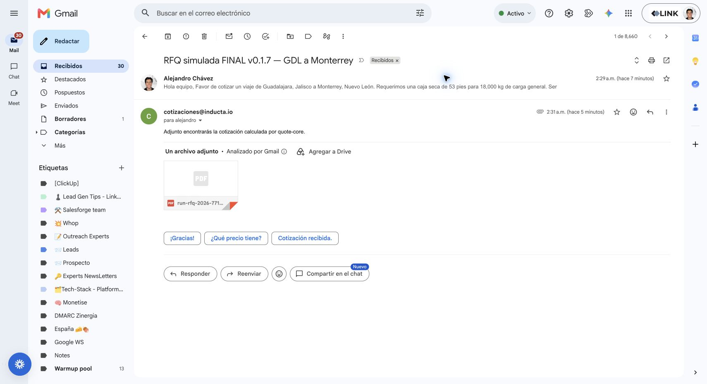

El portal también recibió el pulso final y mostró `v0.1.7` para RESAUX:

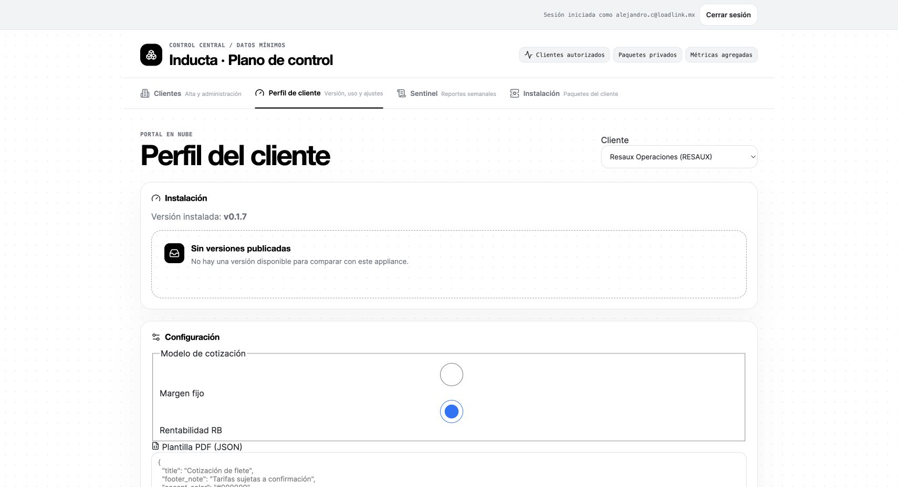

**Resultado final de la corrida:**

- una sola corrida creada por el correo final;
- estado `done`;
- aprobación `approve` auditada;
- agent con cero pollers de correo y API con exactamente uno;
- quote writeback `quote-v2-RFQ-2026-120504-L01` por 34,842.26 MXN;
- status writeback de `RFQ-2026-120504` a `quoted`;
- respuesta enviada y PDF recibido; y
- portal cloud sincronizado en `v0.1.7`.

## Qué errores eran del repositorio y cuáles no

| Síntoma | Clasificación | Resolución |
|---|---|---|
| El primer correo a `cotizaciones@inducta.io` rebotó | Configuración externa aislada: MX raíz en Google | Se usó una bandeja sintética administrada por Resend |
| Dos procesos podían revisar el mismo buzón en `v0.1.5` | Regresión del repositorio detectada durante la simulación | `v0.1.6` devolvió la propiedad del poller únicamente a la API |
| La aprobación hacía el efecto y luego respondía 500 en `v0.1.6` | Defecto del repositorio: FK de auditoría ligada a la tabla equivocada | `v0.1.7` registra decisión y reclama la corrida atómicamente antes de reanudar |
| GHCR respondió 403 al VPS | Acceso del registro privado, no runtime | Build local desde el tag exacto; para producción, login de sólo lectura |

La conclusión no es “un error aislado” en singular: hubo dos fallos derivados del repositorio, ya corregidos en `v0.1.7`, y dos problemas externos de configuración que la prueba separó claramente.

## Checklist de entrega

- [ ] Tenant y correo autorizado correctos.
- [ ] Pack nuevo y token de un solo uso.
- [ ] Versión inmutable, no `latest`.
- [ ] Proyectos ajenos del VPS intactos.
- [ ] Secretos cargados por stdin y archivos en modo `600`.
- [ ] Resend, NVIDIA y SAKBÉ probados individualmente.
- [ ] `required_steps` vacío.
- [ ] Una sola corrida por correo.
- [ ] Aprobación auditada.
- [ ] Writeback verificado.
- [ ] Respuesta y PDF recibidos.
- [ ] Portal cloud en la misma versión que el appliance.
